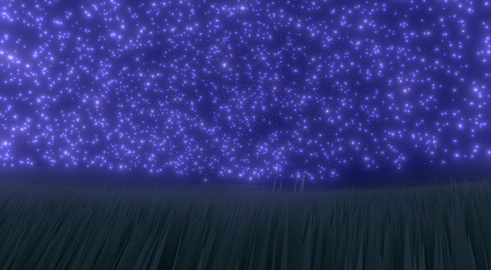

# Post Processing Pipeline For Unity

This code accompanies my [series on Post Processing](https://www.youtube.com/playlist?list=PLUKV95Q13e_Un6ADYZ9NyWJ3W1R2cbCYv) on YouTube.

This is made for Unity 2021.3.1 using the built in pipeline.

## Disclaimer

These effects are modular only for ease of experimentation and finding what looks best for a given scene. Once desired effects have been found, many of the shaders can be condensed into a singular pass to reduce overdraw and maximize performance.

Most of these are also not production ready, they are meant to be referenced for those looking to implement the effects themselves. While they are generally well optimized, they may not account for specific edge cases or might be lacking in desirable features.

## Features

* **Fog**
* * Distance
* **Bloom (HDR)**
* **Depth Based Edge Detection**
* **Color Correction (HDR)**
* * Exposure
* * White Balancing
* * Contrast
* * Brightness
* * Color Filtering
* * Saturation
* **Tonemapping**
* * RGB Clamp
* * Tumblin Rushmeier
* * Schlick
* * Ward
* * Reinhard
* * Reinhard Extended
* * Hable
* * Uchimura
* * Narkowicz ACES
* * Hill ACES
* **Hue Shifting**
* **Sharpness**
* * Basic Sharpening
* * Contrast Adaptive Sharpness
* **Blend Modes**
* * Add/Subtract
* * Multiply
* * Color Burn
* * Color Dodge
* * Overlay
* * Soft Light
* * Vivid Light
* **Pixel Art Effects**
* * Downsampling
* * Dithering
* * Color Palette Swapping
* **Gamma Corrector**
* **[CRT Shader](https://github.com/GarrettGunnell/CRT-Shader)** (not included with this repo)
* **Color Blindness**
* * Protanopia/Protanomaly
* * Deuteranopia/Deuteranomaly
* * Tritanopia/Tritanomaly
* **Kuwahara Filtering**
* * Basic Kuwahara
* * Generalized Kuwahara
* * Anisotropic Kuwahara w/ Polynomial Weighting
* **Zoom**
* * Anti Aliased Pixel Art Upscaler
* **Difference Of Gaussians**
* * Basic
* * Extended
* **Vignette**
* **Chromatic Aberration**
* **Blur**
* * Box
* * Gaussian

# Examples

## Unmodified

## Fog

## Bloom

## Color Correction (RGB Clamped)

## Hue Shifting

## Sharpness

# Tonemapping

## Tumblin Rushmeier

## Schlick

## Ward

## Reinhard

## Reinhard Extended

## Hable

## Uchimura

## Narkowicz ACES

## Hill ACES

# Blend Modes

All examples are blended with themselves, the image is a gradient from no blending to full blend.

## Add

## Subtract

## Screen

## Multiply

## Color Dodge

## Color Burn

## Overlay

## Soft Light

## Vivid Light

# Pixel Art

Open images in their full resolution for optimal viewing.
Sheik model is exported from melee.

## 2x Downsample

## 1x Downsample + Dither

## 1x Downsample + Dither + Sharpness

Still Frame:

## Color Palette Swapping

Original Colors:  

Palette Swapped (8-bit):  

# Color Blindness Simulation

## Protanopia (Absent L-cone)

## Deuteranopia (Absent M-cone)

## Tritanopia (Absent S-cone)

### More Details

These shaders are useful for testing the usability of your game from the perspective of those with color blindness.

Consider the case below, with the default red and green health bars it is hard for someone who suffers from deuteranopia (the most common form of color blindness) to tell the difference between them at a glance.  

Riot Games is aware of this issue and provides a color blind mode in the options which changes ally health bars to a bright yellow, making the value difference between allies and enemies quite obvious.  

# Kuwahara Filter

## Basic

## Generalized

## Anisotropic

# References

https://catlikecoding.com/unity/tutorials/custom-srp/color-grading/  
https://github.com/tizian/tonemapper  
https://en.wikipedia.org/wiki/Ordered_dithering  
https://www.inf.ufrgs.br/~oliveira/pubs_files/CVD_Simulation/CVD_Simulation.html  
https://en.wikipedia.org/wiki/Kuwahara_filter
